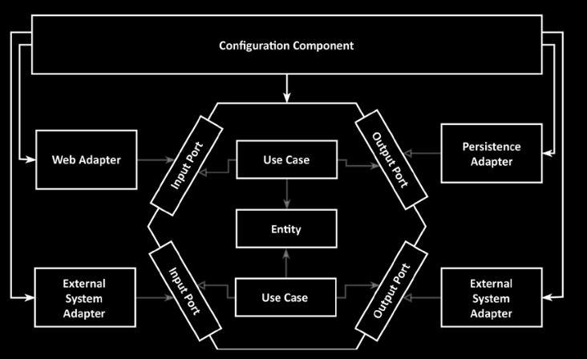
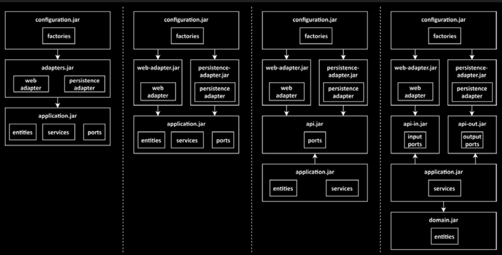
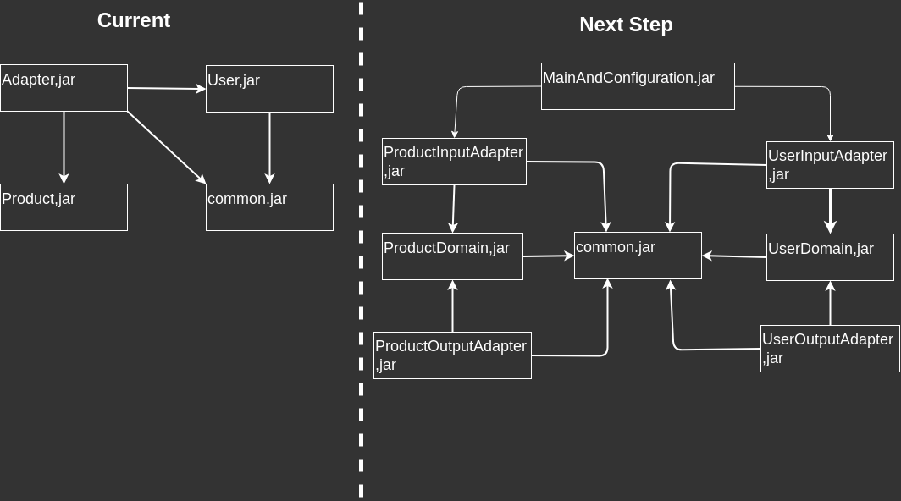
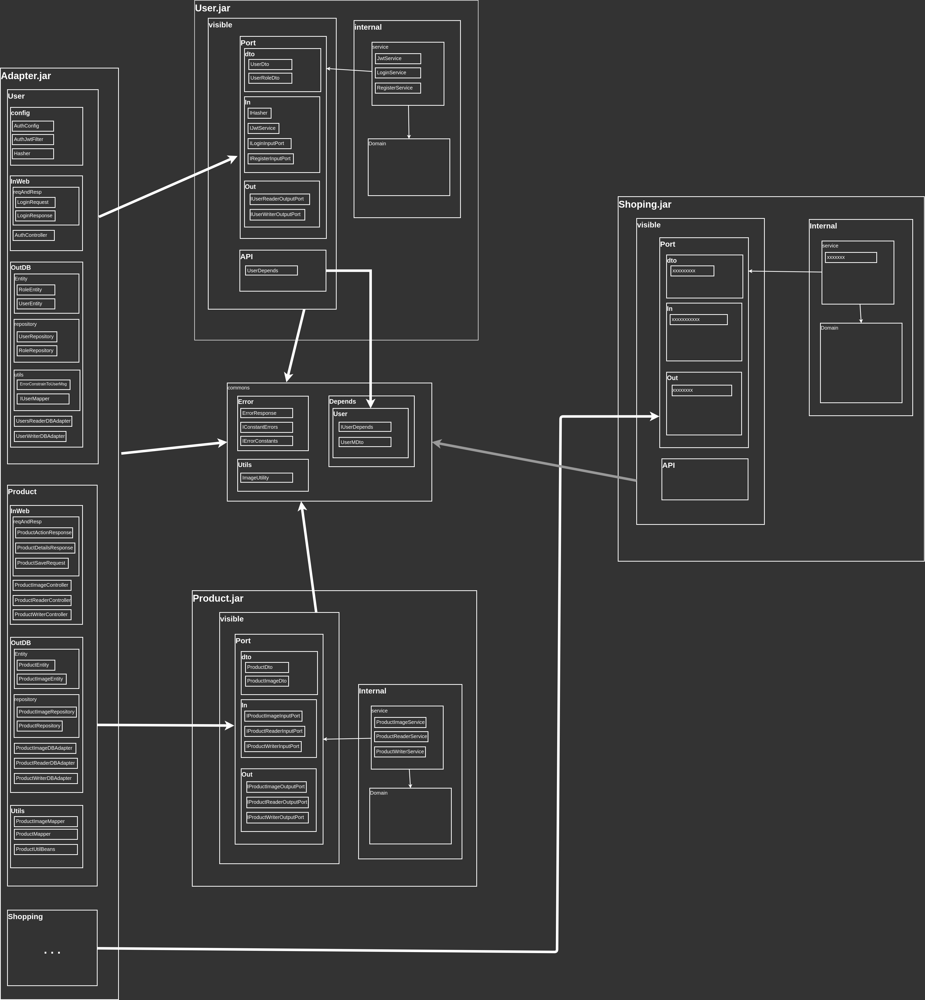

# Backend

## Introduction

This project is intended to be used as a template for future projects. The
main focus is to provide a pre-built architecture and common features, so
the next project I build won’t start it from zero, and I can take advantage of
at least the architecture, and copy and paste some code snippets.

The code follows the hexagonal architecture and, more specifically,
the ones described in the following books.

1. Get Your Hands Dirty on Clean Architecture by Tom Hombergs
2. Spring in Action, 6Ed by Craig Walls
3. Spring Boot and Angular Hands-on full stack by Devlin Basilan and Seiji Ralph
4. Clean Code by Robert C. Martin
5. Code That Fits in Your Head by C. Martin

The idea is to follow a specific architecture and patterns from a specific source
as faithfully as possible, in this case, the book *Get Your Hands Dirty on Clean Architecture by Tom Hombergs*.
This way, if several people work on the same code, they won’t depend on
individuals who might not be available for consultation, but rather on defined
sources and guides, which are much more likely to remain part of the company's
resources. This allows new developers to integrate or replace others using the
same foundation.

## Why I Chose Spring

**DI and IoC**: Dependency Injection (DI) makes it easier to apply Inversion of
Control (IoC), which is an essential part of the family of architectures
based on Clean Architecture by Robert C. Martin, such as Hexagonal Architecture.

**Mature Tools**: Tools like Maven, JUnit, and Hibernate have proven over the
years to be a good fit for enterprise applications. Many developers are already
familiar with them, and there is also a factor of inertia, we can’t just
rebuild projects using new and possibly better tools. We need to keep existing
projects running. These tools focus on features developers really need, such as
modules, libraries, and repositories.

**Reuse of Knowledge**: In my experience, many tools imitate each other in how
they work, making them similar, for example, ASP.NET MVC Core, NestJS, Angular,
Android Dagger, etc. This allows us to reuse knowledge rather than re-learn how
to do the same things. Instead, we can focus on improving and adding features
the client might require. Reusing code is often difficult or even impossible,
but reusing knowledge is easier and more available.

## How it works hexagonal architecture

As I mentioned in the introduction, I'm doing my best to follow the architecture
defined in the first book. However, it's important to understand that there are
different ways to apply this architecture, mostly depending on the size of the
project. In my case, I’m following an approach suitable for a medium-sized
project. First, because time, and second, because I’m just one developer.

From the perspective of entities, I’m following this diagram:

From the perspective of artifacts, I’m following the second column of this
diagram, which shows different ways to apply or evolve the project artifacts:

The important part here is to keep the logic and domain independent of
dependencies, because the core principle of hexagonal architecture is to
separate the layers like an onion. The center of the onion is the domain and
logic, which should not be aware of the existence of the outer layers.

But theory and practice are not always the same. Here's a diagram of the actual
architecture of this project. It doesn’t follow the book exactly, but the
intention is not to be lazy or negligent. The goal is to meet deadlines and
requirements, given the limited resources like time and knowledge.

I'm also applying other well-known principles not mentioned in the main book,
which are in another secondary books, and I believe will help make the project
easier to maintain and evolve.

Here since the point of view of artifacts

Here since the point of view of entities

